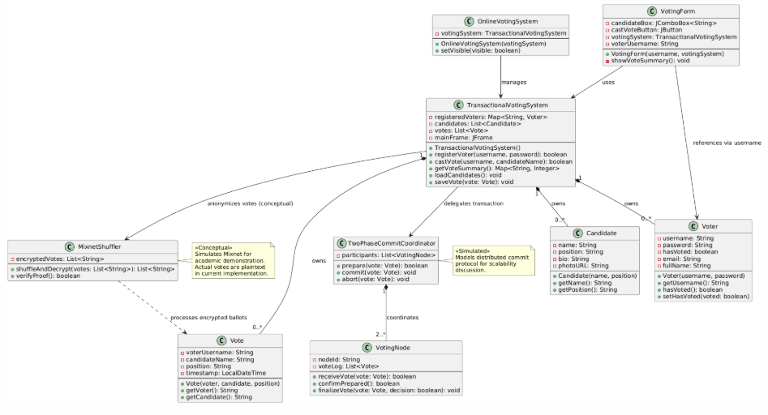

# Transactional Ballot Casting Voting System
A desktop-based Ballot Casting System built with Java Swing, designed for secure and user-friendly electronic voting. It enables users to register, log in, and cast votes while ensuring voter anonymity through a Mixnet-based algorithm, concealing the link between voters and their votes. A Two-Phase Commit (2PC) protocol is also applied to maintain data consistency across storage files, guaranteeing each transaction as either fully completed or rolled back in case of failure. An integrated admin panel allows authorized users to manage candidates, monitor voter activity, and oversee the voting ledger. All data is stored persistently in CSV files for candidates, voters, and votes, preserving records between sessions.    

## Project Overview   
The Online Voting System allows users to:   

• Register and manage voter accounts.

• Log in securely to access the voting portal.  

• Cast votes electronically for available candidates.   

• View vote tallies and election results.    

• Allow administrators to manage candidates, view voter activity, and monitor the voting ledger.    

This version does not implement a database. Instead, all data is stored in .csv files located in the /src/final_proj/data directory.

## Team Members | Roles
| Name | Role |
|------|------|
| Daryl Aurelio | Front-End Designer / Presenter  |
| James David Baman | Algorithm Design / Project Overwiew Reviewer |
| Jhustine Caballero | Lead Programmer/ Framework Developer |
| Andrei Domingo | UI Design / Documentation |
| LJ Martin | Content Editor / Framework Coordinator |

## Features

• Secure voter registration, login, and ballot casting

• Mixnet-based algorithm for maintaining voter anonymity

• Two-Phase Commit (2PC) protocol for consistent and reliable vote transactions

• Admin panel for managing candidates, viewing voter status, and monitoring the voting ledger

• Persistent data storage using CSV files for candidates, voters, and votes

• Real-time validation and confirmation of voting actions

## How to Run the Project
1. Clone the repository:
   ```bash
   git clone https://github.com/Jamesbaman/cce-final-proj.git
   ```
2. Open the project in your preferred IDE (e.g., NetBeans, IntelliJ IDEA).
3. Run the `cce-final-proj.java` file.

##  Screenshots
Screenshots are stored in the `/screenshots` folder.

##  UML Diagram

| Diagram Type | Description | Diagram |
|---------------|--------------|----------|
| Entity Relationship Diagram | Illustrates how the core system functions and the methods that support it |  |

##  License
This project is developed for academic purposes under the University of Mindanao, College of Computing Education.


